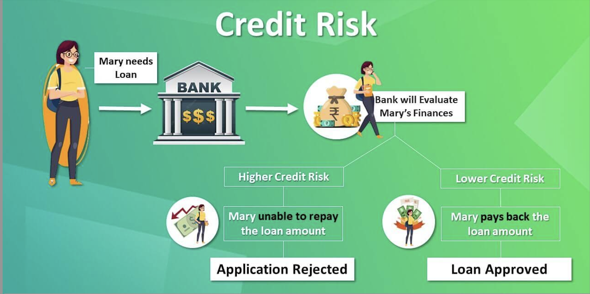
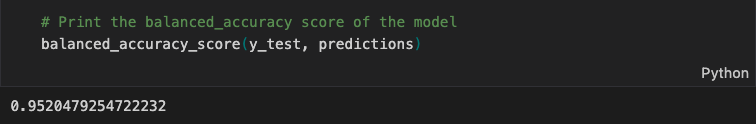
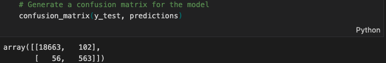
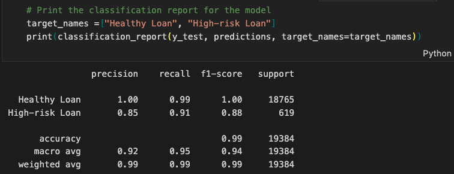
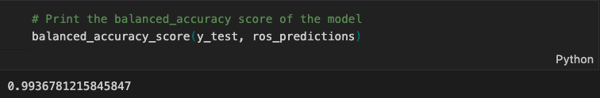
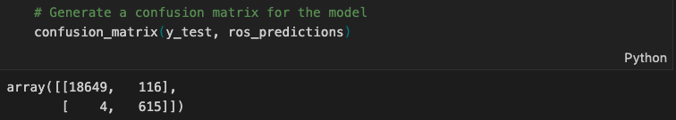
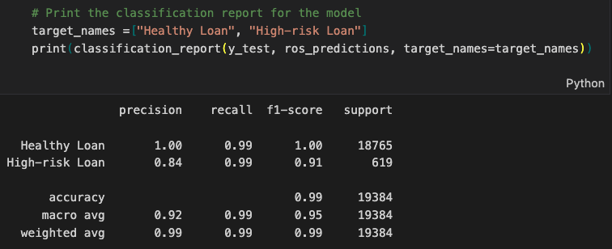

# Credit Risk Analysis Report

  

 

## Table of Contents: 

1. [Overview of the Analysis](#overview-of-the-analysis)

2. [Model Results](#results)

3. [Summary](#summary)

 

## **Overview of the Analysis**

- This report provides an overview of two analyses conducted on a dataset of historical lending activity from a peer-to-peer lending services company. The purpose of both analyses was to build a machine learning model that can identify the creditworthiness of borrowers.

- The first analysis used logistic regression to create a model that predicts whether a loan is healthy or at risk based on six independent variables: loan size, interest rate, borrower income, debt to income ratio, number of accounts, and derogatory marks. The data was split into training and test sets, and two logistic regression models were created using both the original dataset and a resampled dataset to address imbalances. The results were then compared using the scikit-learn library.

- The second analysis also used logistic regression to build a model that predicts whether a loan is healthy or non-healthy based on the loan status provided by the lending company. The model generated an accuracy score of 95%, but the recall value for non-healthy loans was lower than that for healthy loans due to an imbalanced dataset. 
- To address this issue, the data was oversampled using the RandomOverSampler module from the imbalanced-learn library, and a logistic regression model was created using the oversampled dataset. This model achieved an accuracy score of 99% and improved the recall value for non-healthy loans. 
- The results of both analyses demonstrate the importance of addressing imbalanced datasets when building machine learning models for predicting creditworthiness.

 

## **Results**

 

### Logistic Regression Model fitted with Imbalanced Data: 

  

  

 

`The confusion matrix shows that the model made 18649 correct predictions of negative class (TN) and 615 correct predictions of positive class (TP). However, it also made 116 false positive (FP) predictions and 4 false negative (FN) predictions.`

 

  

`The classification report output "print(classification_report(y_test, predictions, target_names=target_names))" shows that the model achieved a higher level of precision, recall, and F1-score on the "Healthy Loan" class compared to the "High-risk Loan" class. Specifically, the model achieved a precision of 1.00 and recall of 0.99 on the "Healthy Loan" class, indicating that it correctly classified all instances of this class without any false positives, while making a small number of false negatives.`

`On the other hand, for the "High-risk Loan" class, the model achieved a precision of 0.85 and recall of 0.91, indicating that it correctly identified the majority of instances of this class while making a moderate number of false positive errors`

 

### Logistic Regression Model fitted with Balanced (oversampled) Data:

  

  

 

`The matrix shows that the model correctly classified 18649 instances of the "Healthy Loan" class (true negatives), and incorrectly classified 116 instances of this class as "High-risk Loan" (false positives). The matrix also shows that the model correctly classified 615 instances of the "High-risk Loan" class (true positives), and incorrectly classified only 4 instances of this class as "Healthy Loan" (false negatives).`

 

  

`It shows that after oversampling the "High-risk Loan" class, the model achieved a higher level of recall and F1-score for this class while maintaining a similar level of precision. Specifically, the model achieved a precision of 0.84 and recall of 0.99 on the "High-risk Loan" class, indicating that it correctly identified the majority of instances of this class while making a higher number of false positive errors.`

 

## **Summary**

- A lending company might want a model that requires classifying healthy loans and High risk loans correctly most of the time

- The analysis of the collected data suggests that the imbalance sampling issue needs to be addressed for better predictions using a Machine Learning Classification Model. 
- Random oversampling of the data can improve the balanced accuracy and recall scores, resulting in more accurate predictions of risky loans. It is essential to minimize false positives and false negatives, as both have costs for the lending company. 
- The Logistic Regression model fitted with oversampled data performed significantly better than the model fitted with imbalanced data, generating higher accuracy and recall scores. The lending company aims to minimize losses by reducing the occurrence of misclassifying high-risk loans as healthy loans, which can result in the loss of profit. 
- The confusion matrices indicated that the model fitted with oversampled data had a substantially lower number of false positives, resulting in better classification of healthy and high risk loans. Therefore, I recommend using the Logistic Regression Model fitted with Balanced (oversampled) data for more accurate loan classification.
