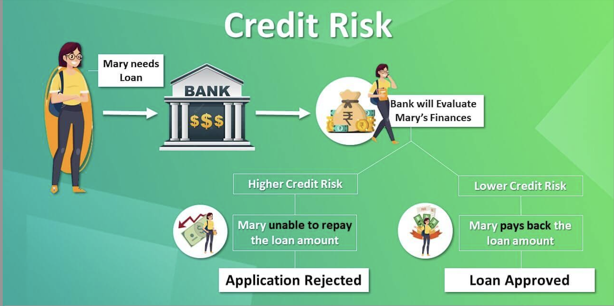

# Credit Risk Analysis Report

  

 

## Table of Contents: 

1. [Overview of the Analysis](#overview-of-the-analysis)

2. [Model Results](#results)

3. [Summary](#summary)

 

## **Overview of the Analysis**

- This report provides an overview of two analyses conducted on a dataset of historical lending activity from a peer-to-peer lending services company. The purpose of both analyses was to build a machine learning model that can identify the creditworthiness of borrowers.

- The first analysis used logistic regression to create a model that predicts whether a loan is healthy or at risk based on six independent variables: loan size, interest rate, borrower income, debt to income ratio, number of accounts, and derogatory marks. The data was split into training and test sets, and two logistic regression models were created using both the original dataset and a resampled dataset to address imbalances. The results were then compared using the scikit-learn library.

- The second analysis also used logistic regression to build a model that predicts whether a loan is healthy or non-healthy based on the loan status provided by the lending company. The model generated an accuracy score of 95%, but the recall value for non-healthy loans was lower than that for healthy loans due to an imbalanced dataset. 
- To address this issue, the data was oversampled using the RandomOverSampler module from the imbalanced-learn library, and a logistic regression model was created using the oversampled dataset. This model achieved an accuracy score of 99% and improved the recall value for non-healthy loans. 
- The results of both analyses demonstrate the importance of addressing imbalanced datasets when building machine learning models for predicting creditworthiness.

 

## **Results**

 

### &nbsp;&nbsp;&nbsp;&nbsp;&nbsp;&nbsp;&nbsp;&nbsp;&nbsp;&nbsp;&nbsp;&nbsp;&nbsp;&nbsp;&nbsp;&nbsp;&nbsp;&nbsp;&nbsp;&nbsp;&nbsp;&nbsp;&nbsp;&nbsp;&nbsp;&nbsp;&nbsp;&nbsp;&nbsp;&nbsp;&nbsp;&nbsp;&nbsp;&nbsp;&nbsp;&nbsp;&nbsp;&nbsp;&nbsp;&nbsp;&nbsp;&nbsp;&nbsp;Logistic Regression Model fitted with Imbalanced Data: 

 

`The Logistic Regression model fitted with the Imbalanced DataSet predicted healthy loans 100% of the time and predicted non-healthy loans 85% of the time.`

 

* The model fitted with imbalanced data has a higher possibility of making these mistakes: 

  * a healthy loan (low-risk) is classified as a non-healthy loan (high-risk).
  * a non-healthy loan (high-risk) is classified as a healthy loan (low-risk).

 

`According to the models recall scores, the model made 1% of mistakes when predicting healthy loans and made 9% of mistakes when predicted non-healthy loans.`

`The model generated an accuracy score of 95% but could be improved due to the dataset being imbalanced.`

 

### &nbsp;&nbsp;&nbsp;&nbsp;&nbsp;&nbsp;&nbsp;&nbsp;&nbsp;&nbsp;&nbsp;&nbsp;&nbsp;&nbsp;&nbsp;&nbsp;&nbsp;&nbsp;&nbsp;&nbsp;&nbsp;&nbsp;&nbsp;&nbsp;&nbsp;&nbsp;&nbsp;&nbsp;&nbsp;&nbsp;&nbsp;&nbsp;&nbsp;&nbsp;&nbsp;&nbsp;&nbsp;&nbsp;&nbsp;&nbsp;&nbsp;&nbsp;&nbsp;Logistic Regression Model fitted with Balanced (oversampled) Data:

 

`The Logistic Regression model fitted with the OverSampled DataSet predicted healthy loans 100% of the time and predicted non-healthy loans 84% of the time.`

 

* The model fitted with balanced (oversampled) data has a much lower possibility of making these mistakes: 

  * a healthy loan (low-risk) is classified as a non-healthy loan (high-risk).
  * a non-healthy loan (high-risk) is classified as a healthy loan (low-risk).

 

`According to the models recall scores, the model made 1% of mistakes when predicting healthy loans and made 1% of mistakes when predicted non-healthy loans.`

`The model generated an accuracy score of 99% due to the dataset being balanced.`

 

## **Summary**

* A lending company might want a model that requires classifying healthy loans and non-healthy loans correctly most of the time: 

    * healthy loans being identified as a non-healthy loan might be more costly for a lending company since it might cause the loss of customers. 
  
    * non-healthy loans being identified as a healthy loan might also be more costly for a lending company due to the loss of funds being provided by the lender.

`The Logistic Regression model fitted with OverSampled data performed much better than the model fitted with Imbalanced data due to the data being balanced and generating a higher accuracy score and a higher recall, indicating that the model will make extremely fewer mistakes when classifying non-healthy loans.`

 

`The lending company would most likely want fewer False Positives due to the high possibility of a lender loosing provided funds when classifying non-healthy loans as healthy. The data below is shown in the confusion matrices which indicates how many healthy/non-healthy loans the model predicted correctly/incorrectly.`

* Model fitted with Imbalanced Data: 
  
  * 56 (FALSE POSITIVES) --> The actual value is healthy and the predicted value is non-healthy 

  * 102 (FALSE NEGATIVES) --> The actual value is non-healthy and the predicted value is healthy

 

* Model fitted with Balanced Data: 
  
  * 4 (FALSE POSITIVES) --> The actual value is healthy and the predicted value is non-healthy 

  * 116 (FALSE NEGATIVES) --> The actual value is non-healthy and the predicted value is healthy
  
`According to the confusion matrices, the number of False Postives drastically decreases indicating the model will classify healthy & non-healthy loans correctly. Based off of this analysis, I would recommend using Model 2 (Logistic Regression Model fitted with Balanced (oversampled) data.`

---